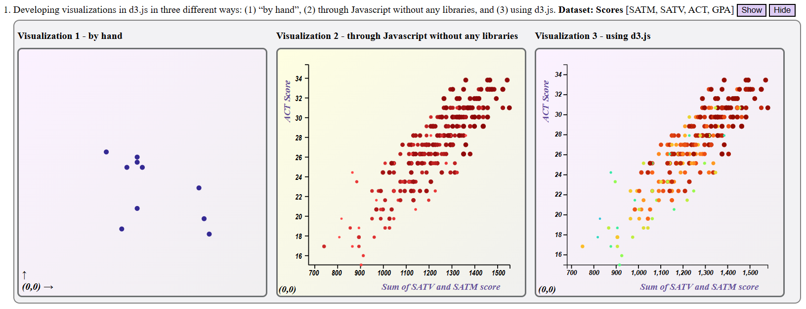
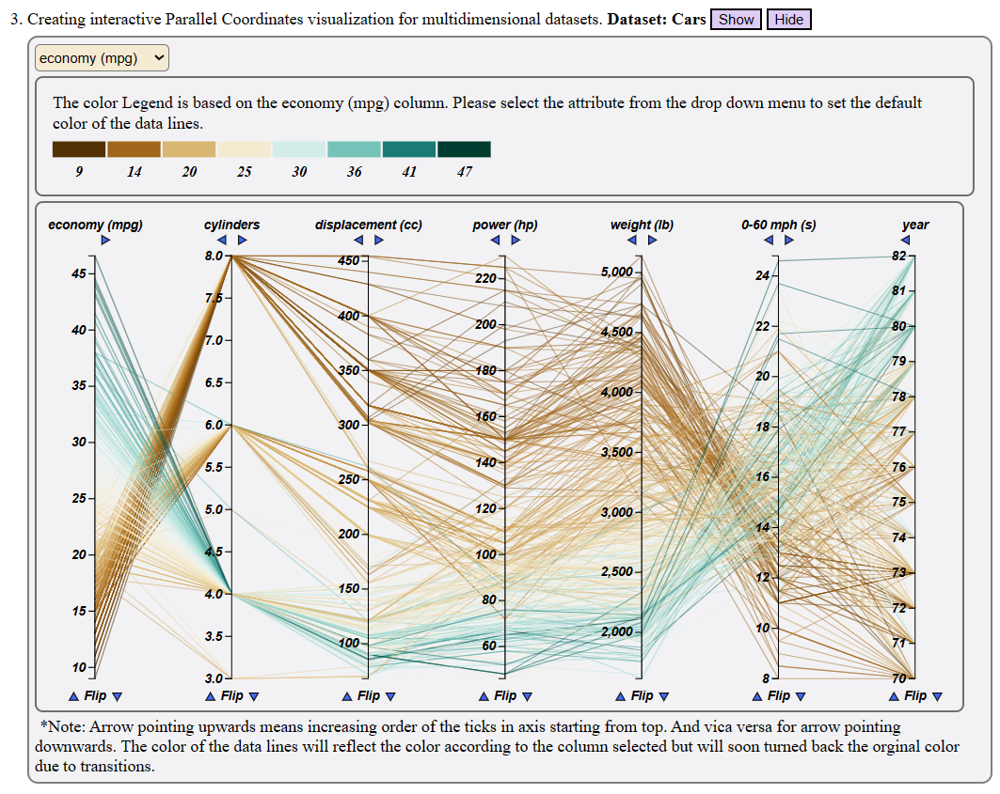
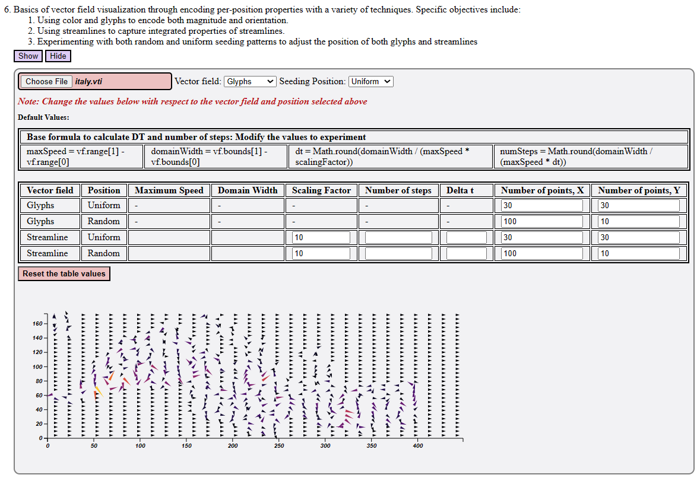

# data-visualization-techniques

Author: Rupal Jain [jainrupal@arizona.edu](mailto:jainrupal@arizona.edu)  
Date: May 25, 2023


## Overview

The "data-visualization-techniques" project is a comprehensive collection of various visualization techniques implemented using d3.js, a powerful JavaScript library for creating interactive and dynamic data visualizations in web browsers. The project aims to demonstrate the ease and effectiveness of utilizing d3.js for creating visually appealing and informative visualizations. It showcases a range of techniques, including brushable scatterplot matrix, parallel coordinates visualization, treemaps, volume rendering for three-dimensional scalar fields, and vector field visualization. Each technique is accompanied by snapshots that provide a glimpse into the visualizations and highlight their capabilities. By exploring this project, users can gain insights into different visualization approaches and leverage the power of d3.js to create compelling visual representations of their own data.


*Fig. 1*: *Home Page*.

## Techniques and Snapshots

1. Ease of Visualizations using d3.js


*Fig. 2*: *Impact of d3.js*.

2. Brushable Scatterplot Matrix. 


*Fig. 3*: *Brushable Scatterplot Matrix*.

3. Parallel Coordinates visualization for multidimensional data.


*Fig. 4*: *Parallel Coordinates visualization*.

4. Treemaps visualization of hierarchical data. 


*Fig. 5*: *Treemaps*.

5. Visualize three-dimensional scalar fields through the use of volume rendering using the VTK library. Please use the vti files in the datasets folder created under technique5 folder.


*Fig. 6*: *3D data visualization using VTK library*.

6. Basics of vector field visualization through encoding per-position properties with a variety of techniques. Specific objectives include:
    * Using color and glyphs to encode both magnitude and orientation.
    * Using streamlines to capture integrated properties of streamlines.
    * Experimenting with both random and uniform seeding patterns to adjust the position of both glyphs and streamlines

    Please use the vti files in the datasets folder created under technique6 folder.


*Fig. 7*: *Execution*.


## Running the program

Follow below steps to view the visualizations.

Firstly, copy this repository to your local directory by executing:

```
git clone https://github.com/RupalJain97/data-vizualization-techniques.git
```

### Execution

Please run the below command in the terminal of the folder in which the repository has been cloned.

Compatibility:
Browser: Google Chrome, Microsoft Edge
OS: Windows

```
start index.html
```
